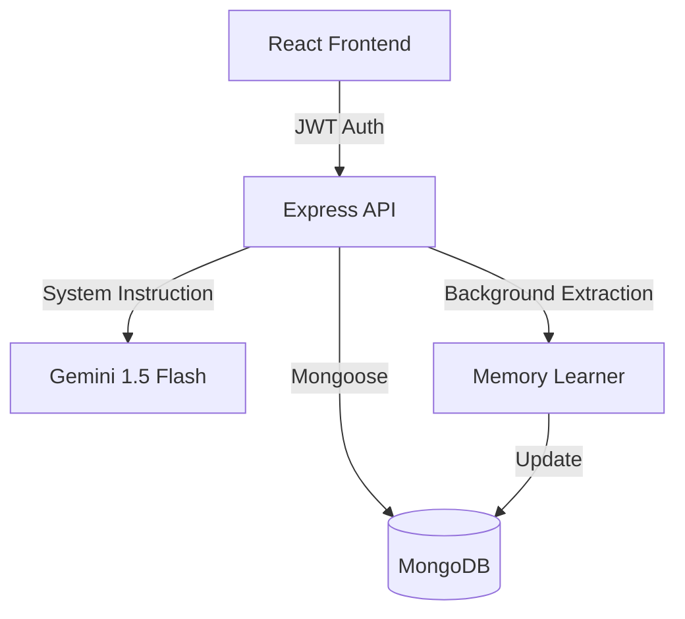

# 🧠 MERN Gemini Elite: Autonomous AI Chatbot

[](https://www.mongodb.com/mern-stack)
[](https://deepmind.google/technologies/gemini/)
[](LICENSE)
[]()

> A next-generation conversational AI platform that doesn't just chat—it **learns**. Built with the MERN stack and powered by Google Gemini 1.5, this application evolves with every interaction.

---

## ✨ Evolutionary Features

### 🚀 **Autonomous Memory Engine** (Breakthrough)
Unlike standard chatbots, MERN Gemini Elite features a background **Heuristic Extraction Layer**.
*   **Zero-Effort Learning**: The AI automatically identifies and stores your name, location, job, and preferences directly from your messages.
*   **Contextual Evolution**: Future responses are automatically personalized using your stored "DNA" (Profile & Preferences).
*   **Full Transparency**: View and manage everything the AI knows about you through the **Memory Manager Dashboard**.

### 📂 **Advanced Workspace Management**
*   **Pro Pinning**: Secure your top 3 high-priority conversations to the top of your workspace.
*   **Smart Rename**: Organize your thoughts with instant session renaming.
*   **Secure Deletion**: Clean your workspace with a safe, modal-confirmed deletion process.
*   **Sorted Workflow**: Automated sorting based on pin status and last-activity timestamps.

### 🎨 **Premium Aesthetic & Formatting**
*   **Developer-Grade Markdown**: Support for complex tables, nested lists, and semantic blockquotes.
*   **Syntax Mastery**: Code blocks rendered with `react-syntax-highlighter`, featuring line numbers and high-contrast professional themes.
*   **Glassmorphism UI**: A stunning, responsive interface with vibrant gradients and smooth micro-animations.

### ⚙️ **Tailored Intelligence**
*   **Persona Control**: Instantly switch AI tones (Professional, Creative, Concise, etc.).
*   **Token Precision**: Adjust the "depth" of AI responses with an integrated max-token slider.
*   **Message Forking**: Edit any previous message to branch the conversation into new possibilities.

---

## 🛠️ Technical Architecture



---

## 🚀 Rapid Deployment

### 1. Backend Core
```bash
cd backend && npm install
```
Configure `.env`:
```env
PORT=4000
MONGO_URI=your_mongodb_uri
GEMINI_API_KEY=your_key
JWT_SECRET=your_secret
```

### 2. Frontend Interface
```bash
cd frontend && npm install
```

### 3. Launch
```bash
# Backend
npm start

# Frontend
npm start
```

---

## 🧪 The "Wow" Test

Want to see the autonomous memory in action? Follow these steps:

1.  **Introduce Yourself**: *"Hi, I'm Hassan. I'm a Senior Dev from Dubai and I love clean code."*
2.  **Verify the 'Brain'**: Click the **Memory Manager** icon in the sidebar. You'll see your job and location already saved.
3.  **The Context Test**: Start a **New Chat** and ask: *"Suggest a dinner based on my location."*
4.  **The Result**: The AI will skip the questions and recommend the best spots in Dubai immediately.

---

## 🏗️ Built With

*   **Logic**: [React.js](https://reactjs.org/) & [Node.js](https://nodejs.org/)
*   **Database**: [MongoDB](https://www.mongodb.com/) & [Mongoose](https://mongoosejs.com/)
*   **AI Engine**: [Google Gemini 1.5 Flash](https://deepmind.google/technologies/gemini/)
*   **Styling**: Vanilla CSS with Glassmorphism
*   **Icons**: [Lucide-React](https://lucide.dev/)
*   **Formatting**: [React-Markdown](https://github.com/remarkjs/react-markdown)

---

Developed by the Hassan.
