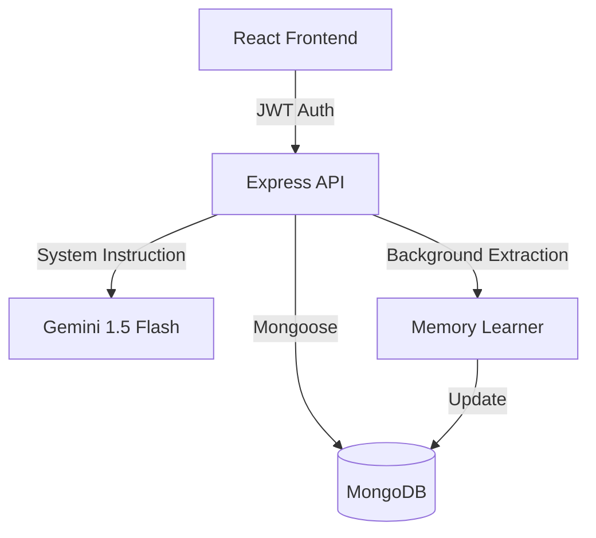

# 🧠 MERN Gemini Elite: Autonomous AI Chatbot

[](https://www.mongodb.com/mern-stack)
[](https://deepmind.google/technologies/gemini/)
[](LICENSE)
[]()

> A next-generation conversational AI platform that doesn't just chat—it **learns**. Built with the MERN stack and powered by Google Gemini 1.5, this application evolves with every interaction.

---

## ✨ Core Innovations

### 🧠 Autonomous Memory Engine
Unlike standard chatbots, MERN Gemini Elite features a background **Heuristic Extraction Layer**. It automatically identifies and stores user context (name, location, preferences) directly from messages, creating a persistent "DNA" for contextual personalization.

### 🖼️ Multimodal Intelligence
*   **Visual Analysis**: Instant analysis, object detection, and scene description for image uploads.
*   **Document Logic**: Full support for PDF and CSV summarization and structured data extraction.
*   **High-Capacity**: Optimized backend to handle file uploads up to 50MB.

### 🐍 Interactive Python Sandbox
Powered by **Pyodide** (WebAssembly), the app executes AI-generated Python code directly in a secure browser sandbox. Features a real-time console for script outputs and error logs.

### 🎙️ Natural Interaction (STT & TTS)
*   **Speech-to-Text**: Real-time microphone input with pulsing visual feedback.
*   **Text-to-Speech**: High-quality synthesis of AI responses with dedicated playback controls.
*   **Hands-Free Mode**: Full voice-driven conversation flow.

### 📂 Advanced Workspace Management
*   **Pro Pinning**: Secure high-priority conversations to the top of your workspace.
*   **Smart Management**: Instant session renaming and secure, modal-confirmed deletion.
*   **Sorted Workflow**: Automated sorting based on activity and pin status.

### 🎨 Premium UI & Formatting
*   **Glassmorphism Aesthetic**: A stunning interface with vibrant gradients and smooth micro-animations.
*   **Developer-Grade Markdown**: Complex tables, nested lists, and semantic blockquotes support.
*   **Syntax Mastery**: Professional code rendering with `react-syntax-highlighter`.

### ⚙️ Tailored Intelligence
*   **Persona Control**: Switch between Professional, Creative, and Concise AI tones.
*   **Token Precision**: Integrated slider to adjust AI response depth.
*   **Message Forking**: Edit previous messages to branch conversations into new directions.

---

## 🛠️ Technical Architecture

### System Flow


### Directory Structure
```text
├── backend/
│   ├── controllers/    # API Request Handlers
│   ├── services/       # Business & AI Integration Logic
│   ├── models/         # Mongoose Database Schemas
│   ├── routes/         # Express API Routes
│   └── middleware/     # Auth & File Handling
└── frontend/
    ├── src/
    │   ├── components/ # Modular UI Components
    │   ├── services/   # Frontend API Clients
    │   └── hooks/      # Custom React Logic Hooks
```

---

## 🚀 Getting Started

### 1. Prerequisites
- Node.js (v18+)
- MongoDB Instance
- Google Gemini API Key

### 2. Backend Setup
```bash
cd backend
npm install
```
Configure your `.env` file:
```env
PORT=4000
MONGO_URI=your_mongodb_uri
GEMINI_API_KEY=your_key
JWT_SECRET=your_secret
```

### 3. Frontend Setup
```bash
cd frontend
npm install
```

### 4. Launch Application
```bash
# Terminal 1: Backend
npm start (within /backend)

# Terminal 2: Frontend
npm start (within /frontend)
```

---

Developed by **Hassan**.
